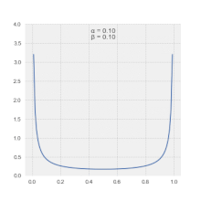
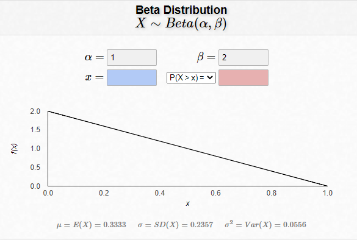

# Skewed Distributions in Game Programming

## The Question
Consider the following question:
> Let's say I want to design a mechanic within a game that has some kind of randomness to it. Let's say this parameter would be a number between 0 and 1. I want to be able to generate this random number, but have it skewed to one side of the distribution. For example, if i generated 10 random numbers on this distribution with 1 decimal point on each, I would want most of the numbers I generate to be closer to 0 than to 1, so like 0.1,  0.2, 0.3, and very few numbers like 0.8 or 0.9.

There are several naive or "good enough" ways to implement such an algorithm, and libraries available to sample from appropriately skewed distributions in almost every programming language. With all these tools at our disposal, we can find an appropriate solution for nearly any problem.

But it brings up an interesting question: how can we create a skewed distribution using only a given uniform pseudorandom value?

In this paper, I will not only comment on a practical solution to the original problem, but also explore the latter question, which addresses a more foundational premise within the context of pseudorandom distributions.

## The Practical Answer
The practical answer to original prompt is: "use a skewed distribution library". Sampling from a well-known distribution is a common functionality available in nearly all programming languages through math or statistics libraries.

Some useful distributions for creating weighted random game variables include the Beta and Gamma distributions (among many others). For this discussion, we'll focus on the Beta function. This is a nice option because it offers highly modifiable curves based on two symmetric parameters:

  
*Animation of some possible shapes created from the Beta function, [courtesy of Wikipedia](https://en.wikipedia.org/wiki/Beta_distribution#Probability_density_function).*

For example, generating random numbers on a `Beta(1,2)` distribution creates a linearly bottom-skewed distribution which closely matches what the original question asks for. We'll consider this example for the next section of this discussion.

You can use [this visualiser](https://homepage.divms.uiowa.edu/~mbognar/applets/beta.html) to see how the shape parameters affect the distribution:
  
*Visualization of the density function of `Beta(1,2)`.*

Libraries available in most programming languages can sample random data from such distributions for efficient use in our projects; let's explore how these functions are implemented behind the scenes, and how we can implement these techniques ourselves to gain a better understand of the math driving them.

## Digging Deeper
If we go beyond the already-built libraries for this functionality and attempt to solve it on our own, we find that this is actually a pretty interesting statistics question!

**The goal:** *Find a function that takes a uniform pseudorandom number between 0 and 1 - such as is produced by the typical rand() function of any programming language - and transforms it into a skewed distribution.*

As above, we'll use the Beta distribution with parameters `Beta(1,2)` for our skewed distribution.

So, we need to somehow transform our uniform pseudorandom input into a Beta-distributed output. But before we investigate that, let's first discuss a very useful concept in statistics: the Cumulative Distribution Function (CDF).

The CDF of a distribution defines the probability that our random variable X is less than or equal to a point x:
```c
// Let F(x) be our general CDF
F(x) = Pr(X <= x)
```
For a uniform distribution, this will simply result in `F(x) = x` which we will take advantage of later.

This relationship with the CDF will allow us to build the transformation we need to turn our uniform input into our Beta distribution. The goal is to find some transformation `T` such that `T(U) = X`, or in other words, a transformation from the uniform variable `U` into the skewed distribution `X`. We can accomplish this using a technique called "Inverse Transform Sampling".

Following [the breakdown provided on Wikipedia](https://en.wikipedia.org/wiki/Inverse_transform_sampling#Intuitions), we do the following intuition:
```c
F(x)
= Pr(X <= x) // by definition
= Pr(T(U) <= x) // substitute our desired conditions T(U) = X
= Pr(U <= T'(x)) // take inverse of both sides (let T' be the inverse of T)
= T'(x) // apply F(x) = Pr(X <= x) = x for uniform distribution

// Thus we find an inverse relationship between the two:
F(x) = T'(x) <=> F'(x) = T(x)
```
And from this we can say that `F'(U) = T(U) = X` which means the inverse of our CDF will transform the uniform random variable U into our desired X!

Let's apply this formula to the specific case of `Beta(1,2)`, our desired distribution. First, we must find the CDF of the Beta distribution: for this, Wikipedia [comes through for us yet again](https://en.wikipedia.org/wiki/Beta_distribution#Cumulative_distribution_function). This CDF is referred to as the "regularized incomplete beta function" `I(a,b)`:
```c
F(x,a,b) = B(x,a,b) / B(a,b) = I(a,b)
B(x,a,b) = integral{0->x} t^(a-1) * (1-t)^(b-1) dt
B(a,b) = B(1,a,b)
```

Using the generic CDF for the Beta distribution, we then plug in our parameters:
```c
B(x,1,2)
= integral{0->x} t^((1)-1) * (1-t)^((2)-1) dt
= integral{0->x} (1-t) dt

B(1,2)
= B(1,1,2)
= integral{0->1} (1-t) dt

F(x,1,2)
= B(x,1,2) / B(1,2)
= integral{0->x} (1-t)dt / integral{0->1} (1-t)dt
= (x - x^2/2) / 0.5
= 2x - x^2
```

Therefore, the CDF of `Beta(1,2)` is `F(x) = 2x - x^2`. To find our desired transformation function `T(x)`, we take the inverse of `F(x)`:
```c
F(x) = y = 2x - x^2

F'(x):
x = 2y - y^2 // invert F(x) variables and re-arrange w.r.t. x
-x = -2y + y^2
1 - x = y^2 - 2y + 1
1 - x = (y - 1)^2
+-sqrt(1-x) = y - 1
1 +- sqrt(1-x) = y
1 - sqrt(1-x) = y // test values to determine root s.t. y->[0,1]

F'(x) = 1 - sqrt(1-x) 
```

So finally, applying the Inverse Transform technique, we have determined a simple function to transform our uniform random variable `U` into our Beta-distributed output `X`:
```c
X = T(U) = F'(U) = 1 - sqrt(1-U)
```

Check out [the accompanying Python script](beta-sample.py) to see the above example used in practice to generate Beta-distributed data using only uniformly-generated random numbers from the `numpy` Python math library.

While this example specifically applied this method to the `Beta(1,2)` distribution, it generalizes to any such distribution and parameter set, with varying levels of difficulty. I'll be interested to study the applications of these concepts more in future game projects!

## References
The primary reference for this paper can be found [here](https://math.stackexchange.com/a/2480717).

[[1](https://en.wikipedia.org/wiki/Beta_distribution)]: Wikipedia article for the Beta distribution

[[2](https://homepage.divms.uiowa.edu/~mbognar/applets/beta.html)]: Visualizer for the Beta distribution

[[3](https://en.wikipedia.org/wiki/Inverse_transform_sampling)]: Wikipedia article for Inverse Transform sampling

[[4](https://math.stackexchange.com/a/2480717)]: Math Stack Exchange post about generating skewed distributions from a uniform data set
